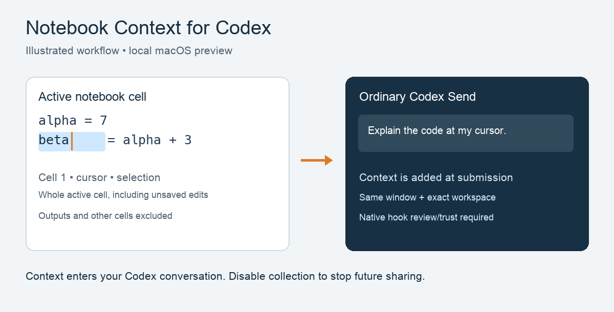

# Notebook Context for Codex

A macOS VS Code extension that gives ordinary **Codex sidebar prompts** the active notebook cell, cursor, and selection, including unsaved edits. Place your cursor or select notebook text, then use Codex's usual Send button.

**macOS preview · independent extension · MIT**. Developed independently of OpenAI and Microsoft. The extension ID remains `shaevitz.codex-notebook-context` for upgrades.



## Install and first use

1. Install the OpenAI Codex VS Code extension and standalone [Node.js](https://nodejs.org/en/download) **20 or newer**. Node embedded inside VS Code is not a standalone executable. The installer checks PATH, Homebrew locations, Volta, asdf and nvm. Set **Notebook Context for Codex: Node Path** to an absolute executable path if needed.
2. Install this extension. For a downloaded VSIX, use **Extensions → … → Install from VSIX**. The preview package is `codex-notebook-context-0.2.0.vsix`.
3. In the command palette, run **Notebook Context for Codex: Install Prompt Hook**. It installs a stable launcher and recovery tools in `$CODEX_HOME/notebook-context/` (default `~/.codex/notebook-context/`) and registers one handler in `hooks.json`. Existing hooks are preserved; `config.toml` is untouched. Set **Codex Home** if the IDE uses a different home directory.
4. Review and trust the exact **Codex Notebook Context** hook through Codex `/hooks`. Use the CLI hook browser with the same Codex home if the IDE does not expose it. The extension never grants hook trust. [Official hook review](https://learn.chatgpt.com/docs/hooks).
5. For chats that were already open, save your work and run **Developer: Reload Window** once, then reopen the chat. Place the cursor or select notebook text again; reload may clear selection state.
6. Open a saved local notebook inside a trusted workspace. The Codex chat directory must exactly equal that notebook's workspace folder, including in multi-root workspaces. Submit a normal sidebar prompt such as “Which cell and cursor position am I using?” No kernel is required.

**Preview Current Context** shows the exact bounded data that can be supplied. **Show Diagnostics** reports compatibility, hook registration, launcher integrity, Node discovery, workspace eligibility and recent socket requests. Diagnostics cannot prove hook trust or delivery into the conversation. Verify a normal prompt after setup or an update. No composer attachment chip is promised.

## What is sent, and when

Each eligible prompt receives the **whole active cell**, not only selected text, plus its language, notebook-relative path, cell number, cursor and selection. The source includes unsaved edits. The default bound is 6,000 UTF-16 units for source and 6,000 for selection; each is configurable from 500 to 20,000. Long source is centered near the cursor and marked truncated. Missing cursor/selection is reported as unavailable. Outputs, other cells and kernel variables are excluded.

Collection requires a focused VS Code window, a trusted local workspace, an active file notebook inside that workspace, an exact chat-directory match, IDE session metadata and the matching extension host in the hook's process ancestry. A different VS Code window's socket is never selected. Remote SSH, WSL, containers, web editors, untitled notebooks, CLI and Codex desktop sessions are excluded.

Source is read from the live editor on demand. Automatic capture writes no notebook snapshots or cell-text logs. The extension collects no telemetry or clipboard data. It uses private Unix sockets with account ownership and permissions checks. **Other processes running as your macOS account are not an isolation boundary** and could impersonate an IDE request. The extension is not a security boundary against malicious same-account software.

Hook context enters **Codex conversation storage** and follows Codex's data handling. Disabling collection stops future context; it does not remove earlier conversation turns. The registered handler sets `additionalContextLimit: 0` to avoid Codex's oversized-hook-output file mechanism, while the extension separately caps payloads. Codex may still store conversation data under its normal rules. **Preview Current Context** explicitly displays source in a VS Code output pane, which VS Code can retain in its local logs. Use Preview only when you are comfortable with that local copy. Diagnostics do not display cell text.

## Compatibility

| Component | Tested baseline |
| --- | --- |
| OS / architecture | Local macOS, Apple Silicon |
| VS Code | 1.140.0 |
| OpenAI Codex extension | 26.5917.62051 |
| Embedded Codex | 0.155.0-alpha.16.3 |
| Standalone Node | See current validation record |

The manifest requires VS Code 1.140 or newer, using stable notebook APIs. Newer VS Code versions and Intel Macs require validation. An unfamiliar **Codex extension version pauses collection by default**. If you deliberately enable **Allow Untested Codex**, test a normal sidebar prompt and report a reproducible result. This is an opt-in preview, not a compatibility guarantee.

The hook event/output format is documented by OpenAI. IDE origin identifiers, transcript metadata and extension-host ancestry are observed compatibility dependencies, not a stable public API. Missing or incompatible context adds nothing and lets your prompt continue. A successful socket reply does not prove that Codex accepted the context.

## Upgrade, disable, remove and roll back

- **Disable:** turn off **Notebook Context for Codex: Enabled** to stop future collection immediately.
- **Upgrade from 0.1.0:** install the new VSIX, run **Install Prompt Hook** once, review/trust the changed definition, then refresh existing chats. The old versioned path is replaced with the stable launcher. Unrelated hooks survive.
- **Later compatible upgrades:** the stable launcher continues to request protocol version 1 from the active host; it has no path to a versioned extension folder. If diagnostics says the launcher differs from the installed release, rerun **Install Prompt Hook** to update its scripts, review the change, and verify delivery.
- **Remove:** run **Remove Prompt Hook**, then uninstall the extension and reload VS Code. This removes only recognized extension handlers. Backups and recovery scripts remain for inspection.
- **Already uninstalled:** the leftover hook is inert once its extension host is gone. Remove registration with `node "$HOME/.codex/notebook-context/setup.js" --remove` (use your actual Codex home). Ordinary prompts continue without context. VS Code does not offer this extension an automatic uninstall callback.
- **Roll back:** install the prior VSIX and run its **Install Prompt Hook** to restore compatible managed scripts. Review/trust changes and test delivery. Whole `hooks.json` backups are for comparison: do not overwrite newer unrelated hooks with an old backup.

Setup uses a cooperative exclusive lock, bounded schema checks, private staged files and atomic replacement. If configuration changes while scripts are staged, it aborts and restores prior managed scripts. Concurrent manual writers do not honor this lock; avoid editing `hooks.json` during setup. An interrupted setup can leave `.notebook-context.lock`: inspect it and confirm no setup is running before removing that stale lock. Malformed configuration, symlinks, unsafe permissions and unrecognized files are preserved with an error.

## Development and support

```sh
npm ci
npm run check
npm test
npm run test:integration
npm run package
NOTEBOOK_VSIX=dist/codex-notebook-context-0.2.0.vsix npm run test:integration
```

Integration uses only a synthetic notebook, isolated settings/extensions, and an inert Codex version fixture. Local positive tests place only a synthetic fixture in `.test-workspace/`; approve that exact folder through native Workspace Trust in the isolated profile. Settings, extensions and application shared storage use separate temporary directories. Reuse an approved synthetic profile via `NOTEBOOK_TEST_PROFILE` when testing source and packaged builds. No trust or sandbox bypass flags are used. CI uses a fresh untrusted workspace and checks that the packaged extension supplies no context in Restricted Mode. Positive source and packaged tests must also pass locally before release. It checks actual VS Code APIs and hook IPC; it does not replace a normal-sidebar delivery test with real Codex. Set `VSCODE_EXECUTABLE_PATH` or `VSCODE_VERSION` for repeatable runs. Successful profiles are removed; failed profiles are retained for inspection. No test modifies your normal VS Code profile.

Runtime has no third-party npm dependencies. CI checks Node 20/22/24, packages the allowlisted files and runs the isolated Restricted Mode privacy suite. See [validation](VALIDATION.md), [support](SUPPORT.md), [security](SECURITY.md) and [release process](docs/RELEASING.md).
